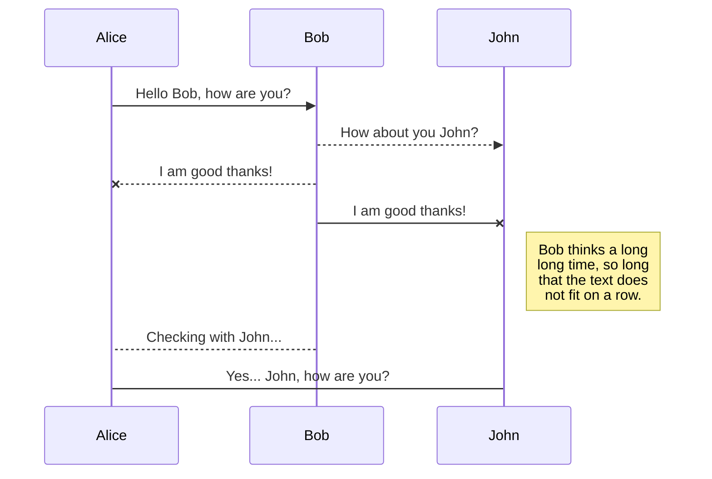
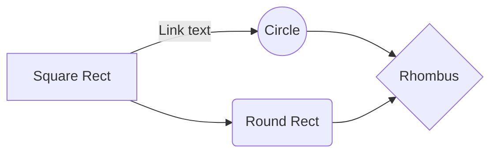

# Welcome to the HTA package!

TODO.

## Prerequisites
Python 3.8 or above.


# Example 1 - Synthetic Data

### Input format:

Since generating a trait-combination matrix may be complicated, HTA generates it for you from a simpler form of input: a stacked set of matrices where each matrix represents one trait, and each entry indicates if the trait manifests or not (0/1) at the corresponding spatial position. 

For **example**, for 2 traits and a 2D space of 32x32, let's generate some random input to HTA:
	
	from hta_stats.hta import HTA
	
    n_traits = 2
    t_shape = (32, 32, n_traits) 
    t = np.random.random(t_shape)   # random values between 0 and 1
    t = (t > 0.5)*1   # binarising to 0/1

Now `t` contains two stacked matrices, each of shape 32x32. The first represents trait no. 1, the second represents trait no. 2 and each entry has either 0/1 (1 indicates the trait manifests in that entry).

### HTA:

Once `t` is ready, running HTA is straight forward. 

For **example**, using `t` from above we can decide on a region size of 8 (i.e., each cell in the grid is 8x8) and run the following:

    region_size = 8   # you can also use [8,8] or [8,16] etc., corresp. to [x,y].
    hta = HTA(t, region_size)
    hta_stat, hta_pval = hta.calc()
    print('HTA {:.2f},  p-val: {:.2e}'.format(hta_stat, hta_pval))

### Heterogeneity maps:

To correctly produce the heterogeneity maps, you must specify the name of the traits as they are ordered in `t` (i.e., the trait at index 0 should be the first (index 0) in the stacked matrices in `t`, and the trait at index n_traits-1 should be last in `t`). You can then call the function `hta.plot_heterogeneity_map(..)`. This function will return a pyplot object which can then be modified to your liking (e.g. adding a legend, title etc.). 

For **example**:

    trait_names = ['Trait {}'.format(i+1) for i in range(n_traits)]
    
    hm = hta.plot_heterogeneity_map(trait_names, dot_size=5)
    hm.legend(loc='upper center', bbox_to_anchor=(0.5, -0.15), ncol=3)
    title = 'HTA {:.2f} (p-val: {:.2e}), region_size={}' \
        .format(hta_stat, hta_pval, region_size)
    font_dict = {'family': 'arial', 'size': 11}
    hm.title(title, fontdict=font_dict)
    hm.savefig('../out/result.jpeg', dpi=350)
    hm.close()

### Region report:

To produce the region report mentioned in the paper (which provides additional information on each region) you can use the following code:

    rr = hta.region_report(trait_names)
    rr.to_csv('../out/region_report.csv')

# Example 2 - Visium data

If you are analysing Visium spatial gene expression data (e.g. any of those listed [here](https://support.10xgenomics.com/spatial-gene-expression/datasets), or [this one](https://support.10xgenomics.com/spatial-gene-expression/datasets/1.1.0/V1_Breast_Cancer_Block_A_Section_1) used in our examples below) you can use our `Visium` built-in class to generate the input format for HTA (i.e., the `t` as in Example 1). 

Make sure you have the following folders from your Visium data:

> filtered_feature_bc_matrix
> spatial

and place them in a folder hierarchy as shown below (all shown files are required):
 ```
data_folder
└───filtered_feature_bc_matrix
│   │   barcodes.tsv.gz
│   │   features.tsv.gz
│   │   matrix.mtx.gz
└───spatial
	│   tissue_positions_list.csv
	│   ...
```

You are now ready to prepare `t` and use HTA:

    from hta_stats.hta import HTA  
    from hta_stats.utils import Visium    
    
    path = "../res/data_folder"  # path to 'data folder' in above hierarchy
    trait_names = ['ERBB2', 'CD8A']   # names of features to use in features.tsv.gz  
      
    # load and prepare visium data for HTA  
    visium = Visium(path)  
    visium.load()  
    t, t_mask = visium.prep(trait_names)  
      
    # compute HTA and HTA p-val  
    region_size = 15   # modify region_size as needed
    hta = HTA(t, region_size=region_size, tissue_mask=t_mask) 
    hta_stat, hta_pval = hta.calc()

>What is `t_mask`? It identifies, using barcodes.tsv.gz, which barcodes are under
> the tissue, and is used to discard barcodeds that are not.

Now we can proceed to produce the heterogeneity map and region report (we've left the p-val formatting in the example below for your convenience, but you can replace it with your own title):

  
    import math
    
    # generate heterogeneity map and legend
    hm = hta.plot_heterogeneity_map(trait_names, dot_size=8)  
    hm.legend(loc='upper center', bbox_to_anchor=(0.5, -0.15), ncol=4, fontsize=9)  
      
    # set format for p-val and title
    if hta_pval <= 10**-10000:  
        title = 'HTA {:.2f} (p-val ~ 0), region size: {}'.format(hta_stat, region_size)  
    elif hta_pval < 0.00001:  
        p_power_with_base_10 = math.log10(hta_pval)  
        hta_pval = p_power_with_base_10  
        title = 'HTA {:.2f} (p-val: 10^{:.0f}), region size: {}'.format(hta_stat, hta_pval, region_size)  
    else:  
        title = 'HTA {:.2f} (p-val: {:.2f}), region size: {}'.format(hta_stat, hta_pval, region_size)  
    
    # save heterogeneity map 
    font_dict = {'family': 'normal', 'size': 9}  
    hm.title(title, fontdict=font_dict)  
    hm.savefig('../out/{}_hetero_map.jpeg'.format('_'.join(trait_names)), dpi=350)  
    hm.close()  
      
    # save region report  
    rr = hta.region_report(trait_names)  
    rr.to_csv('../out/{}_region_report.csv'.format('_'.join(trait_names)))


# Example 3 - Visium with cluster id per barcode

You can also use HTA with cluster IDs generated per barcode. The best example is using the cluster IDs provided in Visium's analysis folder, but you can use your own cluster IDs, provided they have the same format. 

As an example, you can place Visium's analysis folder (see links above) under your data_folder. The analysis folder contains many k-means clustering results where each barcode has a cluster ID.  

The main differences in the code below compared to Example 2 above are in the lines of code marked with (***):


    from hta_stats.utils import Visium  
    from hta_stats.hta import HTA  
      
    path = "../res/data_folder"  
    k = 10
    clusters_path = '{}/analysis/clustering/kmeans_{}_clusters/clusters.csv'.format(path, k)
    trait_names = [str(i+1) for i in range(k)]  
      
    visium = Visium(path)  
    visium.load()  
    t, t_mask = visium.prep_clusters(clusters_path)  # (***)
    
    # copute HTA
    region_size = 15  
    hta = HTA(t, region_size=region_size, tissue_mask=t_mask)  
    hta_stat, hta_pval = hta.calc()  
      
	# plot heretogeneity map
    hm = hta.plot_heterogeneity_map(trait_names, dot_size=8, is_clusters=True)  # (***)
    hm.legend(loc='upper center', bbox_to_anchor=(0.5, -0.15), ncol=4, fontsize=9)  
    
    # save heterogeneity map 
    title = 'HTA {:.2f} (p-val: {:.2f}), region size: {}'.format(hta_stat, hta_pval, region_size)
    font_dict = {'family': 'normal', 'size': 9}  
    hm.title(title, fontdict=font_dict)  
    hm.savefig('../out/{}_hetero_map.jpeg'.format('_'.join(trait_names)), dpi=350)  
    hm.close()  
      
    # save region report  
    rr = hta.region_report(trait_names)  
    rr.to_csv('../out/{}_region_report.csv'.format('_'.join(trait_names)))

## Rename a file

You can rename the current file by clicking the file name in the navigation bar or by clicking the **Rename** button in the file explorer.

## Delete a file

You can delete the current file by clicking the **Remove** button in the file explorer. The file will be moved into the **Trash** folder and automatically deleted after 7 days of inactivity.

## Export a file

You can export the current file by clicking **Export to disk** in the menu. You can choose to export the file as plain Markdown, as HTML using a Handlebars template or as a PDF.


# Synchronization

Synchronization is one of the biggest features of StackEdit. It enables you to synchronize any file in your workspace with other files stored in your **Google Drive**, your **Dropbox** and your **GitHub** accounts. This allows you to keep writing on other devices, collaborate with people you share the file with, integrate easily into your workflow... The synchronization mechanism takes place every minute in the background, downloading, merging, and uploading file modifications.

There are two types of synchronization and they can complement each other:

- The workspace synchronization will sync all your files, folders and settings automatically. This will allow you to fetch your workspace on any other device.
	> To start syncing your workspace, just sign in with Google in the menu.

- The file synchronization will keep one file of the workspace synced with one or multiple files in **Google Drive**, **Dropbox** or **GitHub**.
	> Before starting to sync files, you must link an account in the **Synchronize** sub-menu.

## Open a file

You can open a file from **Google Drive**, **Dropbox** or **GitHub** by opening the **Synchronize** sub-menu and clicking **Open from**. Once opened in the workspace, any modification in the file will be automatically synced.

## Save a file

You can save any file of the workspace to **Google Drive**, **Dropbox** or **GitHub** by opening the **Synchronize** sub-menu and clicking **Save on**. Even if a file in the workspace is already synced, you can save it to another location. StackEdit can sync one file with multiple locations and accounts.

## Synchronize a file

Once your file is linked to a synchronized location, StackEdit will periodically synchronize it by downloading/uploading any modification. A merge will be performed if necessary and conflicts will be resolved.

If you just have modified your file and you want to force syncing, click the **Synchronize now** button in the navigation bar.

> **Note:** The **Synchronize now** button is disabled if you have no file to synchronize.

## Manage file synchronization

Since one file can be synced with multiple locations, you can list and manage synchronized locations by clicking **File synchronization** in the **Synchronize** sub-menu. This allows you to list and remove synchronized locations that are linked to your file.


# Publication

Publishing in StackEdit makes it simple for you to publish online your files. Once you're happy with a file, you can publish it to different hosting platforms like **Blogger**, **Dropbox**, **Gist**, **GitHub**, **Google Drive**, **WordPress** and **Zendesk**. With [Handlebars templates](http://handlebarsjs.com/), you have full control over what you export.

> Before starting to publish, you must link an account in the **Publish** sub-menu.

## Publish a File

You can publish your file by opening the **Publish** sub-menu and by clicking **Publish to**. For some locations, you can choose between the following formats:

- Markdown: publish the Markdown text on a website that can interpret it (**GitHub** for instance),
- HTML: publish the file converted to HTML via a Handlebars template (on a blog for example).

## Update a publication

After publishing, StackEdit keeps your file linked to that publication which makes it easy for you to re-publish it. Once you have modified your file and you want to update your publication, click on the **Publish now** button in the navigation bar.

> **Note:** The **Publish now** button is disabled if your file has not been published yet.

## Manage file publication

Since one file can be published to multiple locations, you can list and manage publish locations by clicking **File publication** in the **Publish** sub-menu. This allows you to list and remove publication locations that are linked to your file.


# Markdown extensions

StackEdit extends the standard Markdown syntax by adding extra **Markdown extensions**, providing you with some nice features.

> **ProTip:** You can disable any **Markdown extension** in the **File properties** dialog.


## SmartyPants

SmartyPants converts ASCII punctuation characters into "smart" typographic punctuation HTML entities. For example:

|                |ASCII                          |HTML                         |
|----------------|-------------------------------|-----------------------------|
|Single backticks|`'Isn't this fun?'`            |'Isn't this fun?'            |
|Quotes          |`"Isn't this fun?"`            |"Isn't this fun?"            |
|Dashes          |`-- is en-dash, --- is em-dash`|-- is en-dash, --- is em-dash|


## KaTeX

You can render LaTeX mathematical expressions using [KaTeX](https://khan.github.io/KaTeX/):

The *Gamma function* satisfying $\Gamma(n) = (n-1)!\quad\forall n\in\mathbb N$ is via the Euler integral

$$
\Gamma(z) = \int_0^\infty t^{z-1}e^{-t}dt\,.
$$

> You can find more information about **LaTeX** mathematical expressions [here](http://meta.math.stackexchange.com/questions/5020/mathjax-basic-tutorial-and-quick-reference).


## UML diagrams

You can render UML diagrams using [Mermaid](https://mermaidjs.github.io/). For example, this will produce a sequence diagram:



And this will produce a flow chart:

